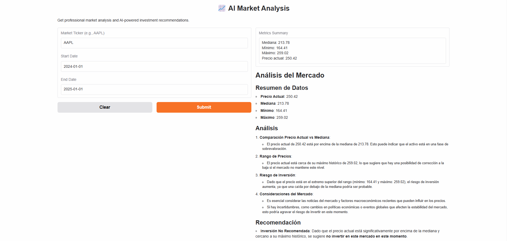

# AI Market Analyzer 📈

A powerful market analysis tool that combines technical analysis with AI-powered recommendations using OpenAI's GPT models.

## Application Preview 🖥️


## Features 🌟

- Real-time market data processing
- Technical analysis metrics calculation
- AI-powered investment recommendations
- Interactive web interface using Gradio
- Normal distribution visualization
- Dockerized deployment support

## Project Structure 📁

```
ai-market-analyzer/
├── app/
│   ├── __init__.py
│   ├── market_data.py
│   ├── plot_utils.py
│   ├── chatbot.py
│   └── app.py
├── requirements.txt
├── .env.example
├── .env
├── .gitignore
├── Dockerfile
├── docker-compose.yml
└── README.md
```

## Prerequisites 📋

- Python 3.8+
- Docker (optional)
- OpenAI API key

## Installation 🚀

### Local Setup

1. Clone the repository:
```bash
git clone https://github.com/JohanCifuentes03/ai-market-analyzer.git
cd ai-market-analyzer
```

2. Create and activate a virtual environment:
```bash
python -m venv venv
source venv/bin/activate  # On Windows: venv\Scripts\activate
```

3. Install dependencies:
```bash
pip install -r requirements.txt
```

4. Set up environment variables:
```bash
cp .env.example .env
```
Edit `.env` and add your OpenAI API key:
```
OPENAI_API_KEY=your_api_key_here
```

### Docker Setup 🐳

1. Build and run using Docker Compose:
```bash
docker-compose up --build
```

The application will be available at `http://localhost:7860`

## Usage 💡

1. Access the web interface at `http://localhost:7860`
2. Enter the stock ticker (e.g., AAPL)
3. Specify the date range for analysis
4. Click "Submit" to get your analysis

## API Reference 📚

### Market Data Module
- `process_market_data(ticker, start_date, end_date)`: Fetches and processes market data
- `get_summary(market_data)`: Calculates key market metrics

### Plot Utils Module
- `plot_normal_distribution(market_data)`: Generates distribution visualization

### Chatbot Module
- `analyze_investment(summary)`: Generates AI-powered investment recommendations

## Contributing 🤝

1. Fork the repository
2. Create your feature branch (`git checkout -b feature/AmazingFeature`)
3. Commit your changes (`git commit -m 'Add some AmazingFeature'`)
4. Push to the branch (`git push origin feature/AmazingFeature`)
5. Open a Pull Request

## License 📄

This project is licensed under the MIT License - see the LICENSE file for details